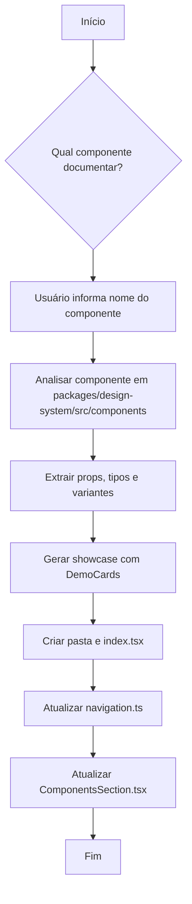

# Agente de Documentação de Componentes - JusCash Design System

## Objetivo

Criar um agente especializado que automatiza a criação de documentação para componentes do JusCash Design System. O agente será interativo, perguntando ao usuário qual componente deseja documentar e gerando toda a estrutura de documentação seguindo o padrão estabelecido.

---

## Análise do Padrão Existente

### Estrutura de Arquivos

A documentação dos componentes segue a seguinte estrutura:

```
apps/docs/src/
├── sections/
│   ├── ComponentsSection.tsx          # Hub principal que lista e navega componentes
│   └── components/
│       ├── buttons/
│       │   ├── index.tsx               # ButtonsShowcase
│       │   └── ButtonPlayground.tsx    # Playground interativo
│       ├── card/
│       │   └── index.tsx               # CardShowcase
│       ├── checkbox/
│       │   └── index.tsx               # CheckboxShowcase
│       └── [component-name]/
│           └── index.tsx               # [Component]Showcase
└── types/
    └── navigation.ts                   # Define ComponentKey e SectionKey
```

### Padrão de Showcase

Cada showcase de componente deve:

1. **Importar do Design System**: `@Juscash/design-system`
2. **Ter um DemoCard** com:
   - `title`: Nome da demo
   - `description`: Descrição do que demonstra
   - `code`: String com código exemplo
   - `preview` ou `renderButtons`: JSX com preview visual
3. **Exportar função Showcase**: `export const [Component]Showcase: React.FC`
4. **Estrutura padrão**:
   - Heading2 com nome do componente
   - Body1 com descrição geral
   - Múltiplos DemoCards mostrando variantes

### Exemplo de Código de Showcase

```tsx
"use client";

import React, { useState } from "react";
import {
  [Component],
  Card,
  Space,
  Heading2,
  Body1,
  Body2,
} from "@Juscash/design-system";
import { ButtonPlayground } from "../buttons/ButtonPlayground";

interface DemoCardProps {
  title: string;
  description: string;
  code: string;
  preview: React.ReactNode;
}

const DemoCard: React.FC<DemoCardProps> = ({ title, description, code, preview }) => {
  const [showPlayground, setShowPlayground] = useState(false);

  return (
    <Card
      title={title}
      style={{ width: "100%" }}
      extra={
        <Body2
          onClick={() => setShowPlayground((prev) => !prev)}
          style={{
            background: "none",
            border: "none",
            padding: 0,
            cursor: "pointer",
            color: "#136CE2",
            fontWeight: 600,
          }}
        >
          {showPlayground ? "Ocultar exemplo" : "Exemplo interativo"}
        </Body2>
      }
    >
      <Space direction="vertical" size="middle" style={{ width: "100%" }}>
        <Body1>{description}</Body1>
        {preview}
        {showPlayground ? <ButtonPlayground code={code} /> : null}
      </Space>
    </Card>
  );
};

// Código de exemplo como string para o playground
const basicCode = `import { [Component] } from '@Juscash/design-system';

function [Component]Basic() {
  return (
    <[Component] {...props}>
      Conteúdo
    </[Component]>
  );
}

render(<[Component]Basic />);`;

export const [Component]Showcase: React.FC = () => (
  <Space direction="vertical" size={24} style={{ width: "100%" }}>
    <Heading2>[Component]</Heading2>
    <Body1>
      Descrição do componente e seu propósito no design system.
    </Body1>

    <DemoCard
      title="Básico"
      description="Exemplo básico de uso do componente."
      code={basicCode}
      preview={
        <[Component]>
          Preview do componente
        </[Component]>
      }
    />
  </Space>
);
```

### Arquivos a Modificar

Além do showcase, é necessário:

1. **Atualizar `navigation.ts`**: Adicionar novo `ComponentKey`
2. **Atualizar `ComponentsSection.tsx`**:
   - Importar o novo Showcase
   - Adicionar condição `if (selectedComponent === "nome")` 
   - Adicionar Card na lista de componentes

---

## Especificação do Agente

### Fluxo de Trabalho



### Perguntas do Agente

1. **Qual componente deseja documentar?**
   - Listar componentes disponíveis em `packages/design-system/src/components`
   - Marcar os que já têm documentação

2. **Quais variantes/demos deseja incluir?**
   - Sugerir baseado nas props do componente
   - Exemplos: Básico, Tamanhos, Estados, Com Ícones, etc.

3. **Descrição curta do componente:**
   - Para o Card no hub de componentes

### Arquivos Gerados

Para um componente chamado `Modal`:

```
apps/docs/src/sections/components/modal/
└── index.tsx                 # ModalShowcase
```

### Modificações Necessárias

1. **`apps/docs/src/types/navigation.ts`**:
   ```ts
   export type ComponentKey =
     | "button"
     | ...
     | "modal"; // Adicionar
   ```

2. **`apps/docs/src/sections/ComponentsSection.tsx`**:
   ```tsx
   // Adicionar import
   import { ModalShowcase } from "./components/modal";
   
   // Adicionar condição
   if (selectedComponent === "modal") {
     return (
       <Space vertical size={16} style={{ width: "100%" }}>
         <Button type="secondary" onClick={() => onSelect(null)}>
           ← Voltar
         </Button>
         <ModalShowcase />
       </Space>
     );
   }
   
   // Adicionar Card no return
   <Card
     hoverable
     style={{ width: 280 }}
     onClick={() => onSelect("modal")}
   >
     <Heading4>Modal</Heading4>
     <Body2 style={{ color: "rgba(0,0,0,0.6)" }}>
       Descrição curta do componente Modal.
     </Body2>
   </Card>
   ```

---

## Fases do Plano

### Fase 1: Criação do Playbook do Agente (P)

**Objetivo**: Definir as instruções do agente em `.context/agents/`

**Tarefas**:
- [ ] Criar arquivo `.context/agents/component-docs-agent.md`
- [ ] Definir persona e expertise
- [ ] Documentar o fluxo de trabalho
- [ ] Incluir templates e padrões

### Fase 2: Implementação (E)

**Objetivo**: Criar o arquivo do agente com instruções detalhadas

**Arquivo**: `.context/agents/component-docs-agent.md`

**Conteúdo do Agente**:
- Instruções passo a passo
- Templates de código
- Checklist de validação
- Exemplos de interação

### Fase 3: Validação (V)

**Objetivo**: Testar o agente documentando um componente

**Tarefas**:
- [ ] Executar o agente para um componente não documentado
- [ ] Verificar se arquivos foram criados corretamente
- [ ] Validar se o app `docs` compila sem erros
- [ ] Confirmar navegação funcionando

---

## Componentes Disponíveis para Documentar

### Já Documentados ✅
- Button
- Typography
- Segmented
- Checkbox
- Radio
- Switch
- Tag
- Input
- Select
- Card
- PageHeader
- Form
- Upload
- Table

### Pendentes de Análise 📋
- *(Verificar se há novos componentes no design-system)*

---

## Próximos Passos

1. **Aprovar este plano** para iniciar a fase de execução
2. **Criar o playbook do agente** em `.context/agents/component-docs-agent.md`
3. **Testar com um componente** para validar o fluxo

---

## Rollback

Se algo der errado:
- Os arquivos criados podem ser simplesmente deletados
- As modificações em `navigation.ts` e `ComponentsSection.tsx` podem ser revertidas via git

---

## Critérios de Sucesso

- [ ] Agente consegue listar componentes disponíveis
- [ ] Agente gera showcase seguindo padrão exato
- [ ] Arquivos de navegação são atualizados corretamente
- [ ] App `docs` compila sem erros após documentação
- [ ] Novo componente aparece na lista e é navegável
